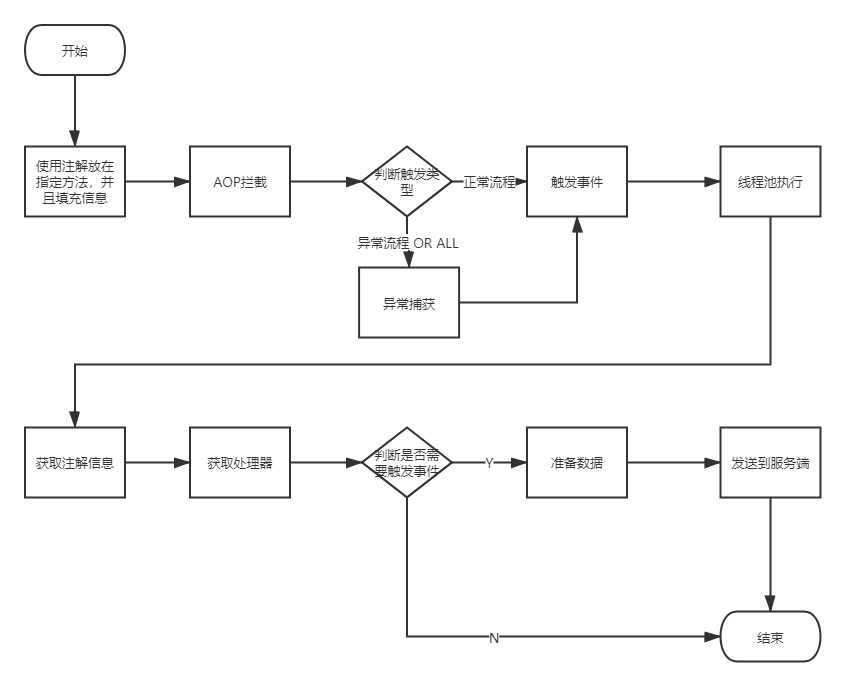

先贴上本人CSDN博客： https://me.csdn.net/yao05199  有空大爷们来坐坐

# Event事件处理机制

作者: 汝果嗳″请（罙）嗳  (葬爱飞少)

> 声明：此项目为我在公司开发时，所看到的一个公司自主研发的功能，本项目大多数为自己手写，没有拷贝公司代码（公司有内网，我也拷不出来...）。
>
> 如有雷同，Place Call me,我是个负责人的男人：12348

## Is What

​	我之前的公司是一家保险公司，主流程就是核保、承保；但是在主流程之后，掺杂了很多子流程，这些本来属于主流程的附属，但是经过业务的增加，子流程也在不断的增加，最后导致了整个核保、承保接口的缓慢，所以提出了使用事件+异步的方式，进行业务的解耦。

## HOW

​	本功能主要是通过事件处理机制，对现有主流程下面的子流程进行优化解耦，使用重试和告警机制，来确保任务的触发，和出现异常后的记录。

## WHY

​	使用该功能，可以便捷的对业务主流程进行解耦；同时，减少了使用异步不可控的缺点。可以对事件进行跟踪。

## FLOW CHART

### Event-Client

### Event-Server

